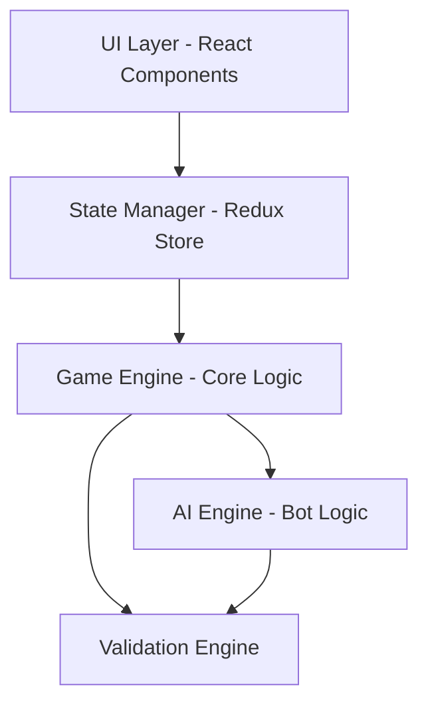

# Design Document

## Overview

Shanko is a digital card game implementation that brings a family-favorite Rummy variant to life with custom artwork and strategic depth. The system will support 2-8 players (human and AI), manage 7 rounds of progressive difficulty, and handle complex mechanics like buying, melding, Joker swapping, and sequence extension.

The architecture prioritizes:
- **Modularity**: Separate concerns for game logic, UI, and AI
- **Extensibility**: Easy to add new features or modify rules
- **Testability**: Clear interfaces and state management
- **Performance**: Efficient card validation and game state updates
- **User Experience**: Smooth animations, clear feedback, and intuitive controls

### Technology Stack

- **Frontend Framework**: React with TypeScript for type safety and component reusability
- **State Management**: Redux Toolkit for predictable game state management
- **Styling**: CSS Modules with animations for card movements
- **AI Logic**: Minimax algorithm with heuristics for strategic decision-making
- **Build Tool**: Vite for fast development and optimized production builds

## Architecture

### High-Level Architecture



### Component Hierarchy

```
App
├── GameSetup (player selection, deck configuration)
├── GameBoard
│   ├── PlayerHand (current player's cards)
│   ├── DiscardPile (visible discard stack)
│   ├── DrawPile (face-down deck)
│   ├── MeldedSets (all players' melded combinations)
│   ├── ScoreBoard (cumulative scores)
│   └── GameControls (draw, discard, meld, buy buttons)
├── BuyDialog (buy priority and confirmation)
├── MeldDialog (combination builder and validator)
└── GameOverScreen (final scores and winner)
```

## Components and Interfaces

### Core Data Models

#### Card

```typescript
interface Card {
  id: string;              // Unique identifier
  rank: Rank;              // 2-10, J, Q, K, A, JOKER
  suit: Suit | null;       // HEARTS, DIAMONDS, CLUBS, SPADES (null for Joker)
  deckIndex: number;       // Which deck this card came from (0-3)
}

enum Rank {
  TWO = '2', THREE = '3', FOUR = '4', FIVE = '5', SIX = '6',
  SEVEN = '7', EIGHT = '8', NINE = '9', TEN = '10',
  JACK = 'J', QUEEN = 'Q', KING = 'K', ACE = 'A', JOKER = 'JOKER'
}

enum Suit {
  HEARTS = 'HEARTS',
  DIAMONDS = 'DIAMONDS',
  CLUBS = 'CLUBS',
  SPADES = 'SPADES'
}
```

#### Combination

```typescript
interface Combination {
  id: string;
  type: 'TRIPLET' | 'SEQUENCE';
  cards: Card[];
  playerId: string;        // Owner of this melded combination
}

interface Triplet extends Combination {
  type: 'TRIPLET';
  cards: [Card, Card, Card];
}

interface Sequence extends Combination {
  type: 'SEQUENCE';
  cards: Card[];           // Minimum 4 cards, can be extended
}
```

#### Player

```typescript
interface Player {
  id: string;
  name: string;
  type: 'HUMAN' | 'AI';
  hand: Card[];
  meldedCombinations: Combination[];
  hasMelded: boolean;
  buysRemaining: number;
  cumulativeScore: number;
  roundScores: number[];   // Score for each of 7 rounds
}
```

#### Game State

```typescript
interface GameState {
  gameId: string;
  players: Player[];
  currentPlayerIndex: number;
  startingPlayerIndex: number;  // Rotates each round
  round: number;                // 1-7
  roundObjective: RoundObjective;
  drawPile: Card[];
  discardPile: Card[];
  phase: GamePhase;
  winner: string | null;
}

enum GamePhase {
  SETUP = 'SETUP',
  DRAW = 'DRAW',
  MELD = 'MELD',
  DISCARD = 'DISCARD',
  BUY_WINDOW = 'BUY_WINDOW',
  ROUND_END = 'ROUND_END',
  GAME_END = 'GAME_END'
}

interface RoundObjective {
  round: number;
  triplets: number;
  sequences: number;
  totalCards: number;
}
```

### Core Interfaces

#### Game Engine

```typescript
interface IGameEngine {
  // Game lifecycle
  initializeGame(playerCount: number, humanPlayers: number): GameState;
  startRound(state: GameState): GameState;
  endRound(state: GameState): GameState;
  
  // Turn actions
  drawCard(state: GameState, source: 'DRAW' | 'DISCARD'): GameState;
  discardCard(state: GameState, cardId: string): GameState;
  meldCombinations(state: GameState, combinations: Combination[]): GameState;
  goOut(state: GameState, combinations: Combination[], finalCard: string): GameState;
  
  // Special actions
  buyCard(state: GameState, playerId: string): GameState;
  swapJoker(state: GameState, combinationId: string, jokerCard: Card, replacementCard: Card): GameState;
  extendSequence(state: GameState, combinationId: string, cards: Card[], position: 'START' | 'END'): GameState;
  
  // Queries
  canPlayerMeld(state: GameState, playerId: string): boolean;
  canPlayerBuy(state: GameState, playerId: string): boolean;
  getBuyPriority(state: GameState): string[];  // Ordered list of player IDs
}
```

#### Validation Engine

```typescript
interface IValidationEngine {
  // Combination validation
  isValidTriplet(cards: Card[]): boolean;
  isValidSequence(cards: Card[]): boolean;
  meetsRoundObjective(combinations: Combination[], objective: RoundObjective): boolean;
  
  // Joker validation
  canSwapJoker(combination: Combination, joker: Card, replacement: Card): boolean;
  canExtendSequence(sequence: Sequence, cards: Card[], position: 'START' | 'END'): boolean;
  
  // Game rule validation
  canPlayerPerformAction(state: GameState, playerId: string, action: Action): ValidationResult;
}

interface ValidationResult {
  valid: boolean;
  error?: string;
}
```

#### AI Engine

```typescript
interface IAIEngine {
  // Decision making
  decideDraw(state: GameState, playerId: string): 'DRAW' | 'DISCARD';
  decideDiscard(state: GameState, playerId: string): Card;
  decideMeld(state: GameState, playerId: string): { shouldMeld: boolean; combinations?: Combination[] };
  decideBuy(state: GameState, playerId: string, discardedCard: Card): boolean;
  decideJokerSwap(state: GameState, playerId: string): { shouldSwap: boolean; swap?: JokerSwapAction };
  
  // Strategy evaluation
  evaluateHand(hand: Card[], objective: RoundObjective): HandEvaluation;
  calculateCardValue(card: Card, context: GameContext): number;
}

interface HandEvaluation {
  completedCombinations: Combination[];
  potentialCombinations: PartialCombination[];
  deadwood: Card[];
  deadwoodPoints: number;
  turnsToComplete: number;  // Estimated
}
```

## Data Models

### Deck Management

The system needs to manage multiple decks based on player count:
- 2-4 players: 2 decks (112 cards)
- 5-6 players: 3 decks (168 cards)
- 7-8 players: 4 decks (224 cards)

Each deck contains 56 cards (52 standard + 4 Jokers). Cards are uniquely identified by combining rank, suit, and deck index.

```typescript
class DeckManager {
  static createDecks(playerCount: number): Card[] {
    const deckCount = this.getDeckCount(playerCount);
    const cards: Card[] = [];
    
    for (let deckIndex = 0; deckIndex < deckCount; deckIndex++) {
      cards.push(...this.createSingleDeck(deckIndex));
    }
    
    return this.shuffle(cards);
  }
  
  private static getDeckCount(playerCount: number): number {
    if (playerCount <= 4) return 2;
    if (playerCount <= 6) return 3;
    return 4;
  }
  
  private static createSingleDeck(deckIndex: number): Card[] {
    const cards: Card[] = [];
    
    // Add standard cards
    for (const suit of Object.values(Suit)) {
      for (const rank of [TWO, THREE, ..., KING, ACE]) {
        cards.push({ id: generateId(), rank, suit, deckIndex });
      }
    }
    
    // Add 4 Jokers
    for (let i = 0; i < 4; i++) {
      cards.push({ id: generateId(), rank: JOKER, suit: null, deckIndex });
    }
    
    return cards;
  }
}
```

### Round Objectives

```typescript
const ROUND_OBJECTIVES: RoundObjective[] = [
  { round: 1, triplets: 2, sequences: 0, totalCards: 6 },
  { round: 2, triplets: 1, sequences: 1, totalCards: 7 },
  { round: 3, triplets: 0, sequences: 2, totalCards: 8 },
  { round: 4, triplets: 3, sequences: 0, totalCards: 9 },
  { round: 5, triplets: 2, sequences: 1, totalCards: 10 },
  { round: 6, triplets: 1, sequences: 2, totalCards: 11 },
  { round: 7, triplets: 0, sequences: 3, totalCards: 12 }
];
```

### Scoring System

```typescript
class ScoringEngine {
  static getCardPoints(card: Card): number {
    if (card.rank === JOKER) return 50;
    if (card.rank === ACE) return 15;
    if ([JACK, QUEEN, KING].includes(card.rank)) return 10;
    return parseInt(card.rank);
  }
  
  static calculateRoundScore(hand: Card[]): number {
    return hand.reduce((sum, card) => sum + this.getCardPoints(card), 0);
  }
  
  static determineWinner(players: Player[]): Player {
    return players.reduce((winner, player) => 
      player.cumulativeScore < winner.cumulativeScore ? player : winner
    );
  }
}
```

## Error Handling

### Validation Errors

```typescript
enum ValidationError {
  INVALID_TRIPLET = 'Cards do not form a valid triplet',
  INVALID_SEQUENCE = 'Cards do not form a valid sequence',
  INSUFFICIENT_COMBINATIONS = 'Does not meet round objective',
  OUT_OF_TURN = 'Action not allowed out of turn',
  NO_BUYS_REMAINING = 'No buy actions remaining',
  CANNOT_BUY_AFTER_MELD = 'Cannot buy after melding',
  INVALID_JOKER_SWAP = 'Invalid Joker swap',
  SEQUENCE_WRAP_NOT_ALLOWED = 'Sequence wrapping not allowed',
  JOKER_SWAP_TRIPLET_NOT_ALLOWED = 'Cannot swap Jokers from triplets'
}
```

### Error Recovery

- **Invalid meld attempt**: Display error message, allow player to retry
- **Network disconnection**: Pause game, attempt reconnection, convert to AI if timeout
- **Invalid state**: Log error, attempt state recovery from last valid checkpoint
- **AI decision timeout**: Use fallback strategy (random valid move)

## Testing Strategy

### Unit Tests

1. **Validation Engine**
   - Test all triplet validation scenarios (with/without Jokers)
   - Test all sequence validation scenarios (including Ace positions)
   - Test round objective validation
   - Test Joker swap validation
   - Test sequence extension validation

2. **Scoring Engine**
   - Test card point calculations
   - Test round score calculations
   - Test cumulative score tracking
   - Test winner determination

3. **Deck Manager**
   - Test deck creation for different player counts
   - Test card uniqueness
   - Test shuffle randomness

4. **Game Engine**
   - Test game initialization
   - Test round progression
   - Test turn flow (draw → meld → discard)
   - Test buy mechanics and priority
   - Test going out logic

### Integration Tests

1. **Complete Round Flow**
   - Initialize game → deal cards → play turns → meld → go out → score
   
2. **Buy Priority System**
   - Multiple players attempting to buy
   - Priority resolution
   - Melded players excluded from buying

3. **Joker Mechanics**
   - Joker in combinations
   - Swapping Jokers
   - Extending sequences with swapped Jokers

4. **AI Behavior**
   - AI makes valid moves
   - AI follows buy limits
   - AI melds when advantageous
   - AI goes out correctly

### End-to-End Tests

1. **Complete 7-Round Game**
   - Play through all rounds
   - Verify score accumulation
   - Verify winner determination

2. **Multi-Player Scenarios**
   - 2-player game (no buying)
   - 4-player game (full buying mechanics)
   - 8-player game (4 decks)

3. **Edge Cases**
   - Draw pile depletion and reshuffling
   - All players pass on buying
   - Player goes out on first turn after melding

## AI Strategy

### Decision Framework

The AI uses a utility-based decision system that evaluates actions based on:

1. **Hand Strength**: How close to completing the round objective
2. **Deadwood Points**: Total points of unmatched cards
3. **Turn Estimation**: Estimated turns needed to go out
4. **Risk Assessment**: Probability of opponents going out first

### AI Difficulty Levels

```typescript
enum AIDifficulty {
  EASY = 'EASY',      // Makes obvious mistakes, doesn't optimize
  MEDIUM = 'MEDIUM',  // Plays reasonably, occasional suboptimal moves
  HARD = 'HARD'       // Near-optimal play, considers opponent hands
}
```

### Key AI Behaviors

**Drawing Decision**:
- Prefer discard pile if card completes/advances a combination
- Consider deadwood reduction
- Avoid drawing from discard if it signals hand composition

**Discarding Strategy**:
- Discard highest-point deadwood first
- Avoid discarding cards that help opponents (track their picks)
- Keep cards that form multiple potential combinations

**Buying Decision**:
- Buy if card completes a combination
- Buy if card significantly advances objective
- Consider buy limit (save buys for critical cards)
- More aggressive buying in later rounds

**Melding Timing**:
- Meld early if hand is weak (minimize potential loss)
- Delay melding if close to going out (surprise factor)
- Consider opponent progress (meld if someone else is close)

**Joker Management**:
- Use Jokers in sequences (swappable) over triplets when possible
- Swap Jokers when holding the actual card
- Extend sequences to discard more cards

## UI/UX Considerations

### Visual Feedback

- **Card Selection**: Highlight selected cards with border/glow
- **Valid Combinations**: Green indicator when forming valid triplet/sequence
- **Invalid Combinations**: Red indicator with error message
- **Buy Window**: Modal dialog with timer and priority indicator
- **Animations**: Smooth card movements (deal, draw, discard, buy)
- **Turn Indicator**: Clear visual showing whose turn it is

### Accessibility

- **Keyboard Navigation**: Full game playable with keyboard
- **Screen Reader Support**: Announce game state changes
- **Color Blind Mode**: Use patterns in addition to colors for suits
- **Font Scaling**: Support larger text for readability
- **High Contrast Mode**: Alternative color scheme

### Mobile Responsiveness

- **Touch Gestures**: Tap to select, drag to organize hand
- **Responsive Layout**: Adapt to portrait/landscape orientations
- **Card Sizing**: Scale cards based on screen size
- **Simplified Controls**: Larger touch targets for mobile

## Performance Considerations

### Optimization Strategies

1. **Memoization**: Cache validation results for card combinations
2. **Virtual Scrolling**: For large hands (after multiple buys)
3. **Lazy Loading**: Load card artwork on demand
4. **State Updates**: Batch Redux updates to minimize re-renders
5. **AI Computation**: Run AI decisions in Web Worker to avoid blocking UI

### Memory Management

- **Card Pooling**: Reuse card objects across rounds
- **State Cleanup**: Clear completed round data
- **Image Optimization**: Use sprite sheets for card artwork
- **Garbage Collection**: Explicitly null large objects when done

## Security Considerations

### Client-Side Validation

- Validate all player actions before state updates
- Prevent cheating through browser dev tools (obfuscate game state)
- Rate limit actions to prevent automation

### Future Multiplayer Considerations

If extending to online multiplayer:
- **Server Authority**: Server validates all moves
- **Anti-Cheat**: Server-side hand verification
- **Encryption**: Secure WebSocket communication
- **Authentication**: Player identity verification

## Deployment Strategy

### Build Process

1. **Development**: Vite dev server with hot reload
2. **Testing**: Run unit/integration tests in CI/CD
3. **Production Build**: Minified, tree-shaken bundle
4. **Asset Optimization**: Compress images, generate sprite sheets

### Hosting Options

- **Static Hosting**: Netlify, Vercel, GitHub Pages (client-only)
- **CDN**: CloudFront for global distribution
- **Progressive Web App**: Service worker for offline play

## Future Enhancements

### Phase 2 Features

1. **Online Multiplayer**: Real-time games with WebSocket
2. **Tournaments**: Bracket-style competitions
3. **Leaderboards**: Global rankings
4. **Achievements**: Unlock badges for milestones
5. **Custom Themes**: Different card artwork sets
6. **Replay System**: Review past games
7. **Tutorial Mode**: Interactive learning experience
8. **Statistics**: Track win rates, average scores, etc.

### Commercialization Features

1. **Physical Card Design**: Export designs for printing
2. **Rule Variations**: Support house rules
3. **Localization**: Multi-language support
4. **Marketing Materials**: Gameplay videos, screenshots
5. **Print-and-Play**: Downloadable PDF version
